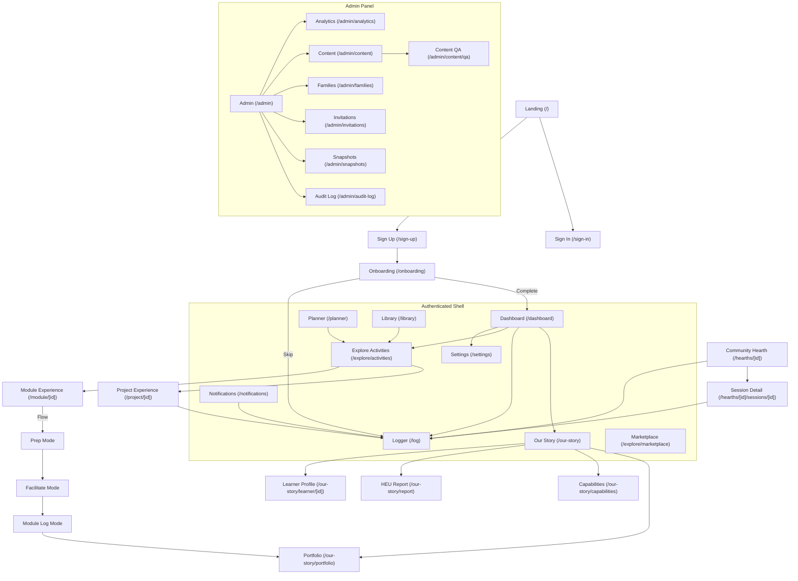

# Hearth LMS — Site Map & Interaction Flow

> **Purpose:** Permanent reference for the Hearth LMS route structure, page interactions, and screen-to-screen flows. Use this as a baseline for E2E testing and parent-facing documentation.

## 🗺️ Mermaid Interaction Map

## 📍 Route Index

### Public & Entry
*   **`/` (Landing):** Public value proposition and entry points.
*   **`/sign-in` & `/sign-up`:** Authentication via Clerk.
*   **`/onboarding`:** Multi-step setup for Family Name, Learners, and Pedagogy preferences.
*   **`/welcome`:** Post-signup introductory content.

### Core Authenticated Screens
*   **`/dashboard`:** The central hub. Provides daily focus, recent activity, and quick access to logging.
*   **`/planner`:** Weekly view for scheduling activities. Includes AI-driven recommendations based on "gaps" in learning threads.
*   **`/log`:** The "Capture" interface. Optimized for the **5-Minute Rule**. Handles photo uploads, keyword matching, and badge assessment triggers.
*   **`/our-story`:** The data-hub for a family's history. Branches to Portfolios, Capability Thread progress, and HEU Reports.
*   **`/library`:** Family's saved packs and materials browser.
*   **`/explore/activities`:** The local library of Packs, Modules, and Projects.
*   **`/explore/marketplace`:** The external repository for adding new content to the family library.

### Specialized Experiences
*   **`/module/[id]`:** Interactive, multi-mode session engine (Prep > Facilitate > Log).
*   **`/project/[id]`:** Multi-stage project tracker with progress bars and artifact notes.
*   **`/badges/assess/[id]`:** Deep-dive assessment interface triggered when a learner reaches a thread threshold.
*   **`/hearths/[id]`:** Community group interface for sharing prompts and reflections.
*   **`/hearths/[id]/sessions/[id]`:** Session detail with evidence, observations, reflections.
*   **`/hearths/join/[code]`:** Community invite acceptance flow.
*   **`/invite`:** Family invite / provider code acceptance.

### Admin Panel (`(admin)/`)
*   **`/admin`:** Admin dashboard with ops summary.
*   **`/admin/analytics`:** Thread coverage, abandonment, activity heat, pack adoption.
*   **`/admin/content`:** Content studio draft management.
*   **`/admin/content/qa`:** Pack quality assurance and issue tracking.
*   **`/admin/families`:** Family search, view, snapshot management.
*   **`/admin/invitations`:** Beta invitation code management.
*   **`/admin/snapshots`:** Snapshot health, stale detection, bulk rebuild.
*   **`/admin/audit-log`:** Admin action audit trail.

### Demo & Dev
*   **`/demo/*`:** Full app demo without Clerk auth (mirrors all auth routes).
*   **`/dev-preview/*`:** Dev preview routes (subset of screens).
*   **`/studio`:** Embedded Sanity Studio.

## 📄 Documentation Strategy (EX-First)

For every page listed above, we maintain high-detail documentation using the following template to ensure the **EX (Experience)** is clear for parents and tests.

### **Page Documentation Template**
1.  **Purpose:** What is the core value proposition of this screen for the parent?
2.  **Navigation Context:** How do they get here? Where do they go next?
3.  **Core EX Principles:** (e.g., "The 5-Minute Rule", "Gentle Friend Tone").
4.  **Functional Specification:** All interactive elements and their data impact.
5.  **Use Cases for Parents:** Real-world scenarios for this screen.
6.  **Test Scenarios:** Critical paths for QA and automated E2E testing.
7.  **Data Relationships:** Entities read/written (Learners, Entries, Threads).

---

*Last updated: 12 April 2026*
