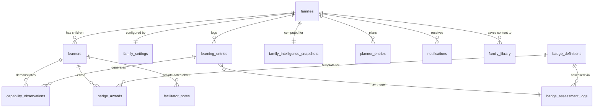
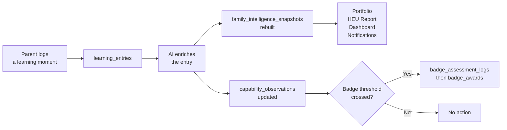

<!-- Version: 1 | Date: 2026-03-09 | Changes: Initial creation — database schema overview for stakeholder communication -->

# Hearth LMS — Data Architecture Overview

## Where data lives

Hearth splits data between two systems. **Sanity CMS** stores reusable educational content that any family can access. **PostgreSQL** (hosted on Neon) stores everything specific to a family — their children, their logged learning, their progress.

The AI layer sits between them: it reads what a parent writes, enriches it with structured educational data, and stores the result in a pre-computed snapshot that every screen reads from.

## The tables, in plain language

| Table | What it holds | Who writes to it |
|-------|--------------|-----------------|
| **families** | Family account — linked to login | System on sign-up |
| **learners** | Each child — name, age, colour code | Parent in Settings |
| **family_settings** | Pedagogy choice, HEU dates, notification prefs | Parent in Settings |
| **learning_entries** | Every logged learning moment — the core of Hearth | Parent via Logger or Module log |
| **capability_observations** | Evidence that a child has demonstrated a skill | AI enrichment + parent confirmation |
| **badge_definitions** | What a badge means and what's required to earn it | Content team (may also live in Sanity) |
| **badge_awards** | Record of a badge earned by a specific child | Parent via Badge Assessment |
| **badge_assessment_logs** | Responses to assessment questions during badge check | Parent via Badge Assessment |
| **planner_entries** | Planned activities for a given day | Parent via Weekly Planner |
| **family_intelligence_snapshots** | Pre-computed summary of everything the AI knows about this family | System — rebuilt automatically after each log |
| **notifications** | Nudges, reminders, and invitations | System — generated from snapshot |
| **facilitator_notes** | Private parent-only notes about a child's learning needs | Parent — encrypted, excluded from all exports and AI |
| **family_library** | Which Sanity content packs a family has added | Parent via Activity Discovery |

## How a single log entry flows through the system

## What lives in Sanity CMS vs PostgreSQL

| Sanity CMS | PostgreSQL |
|-----------|-----------|
| Content packs, modules, activities | Which packs a family has saved |
| Badge templates and criteria | Which badges a child has earned |
| Capability thread definitions | A child's observations against those threads |
| Pedagogy overlay templates | Which pedagogy a family chose |
| Curriculum descriptors | A child's coverage against those descriptors |

The rule is simple: if it's **reusable content**, it's in Sanity. If it's **specific to a family**, it's in PostgreSQL.
