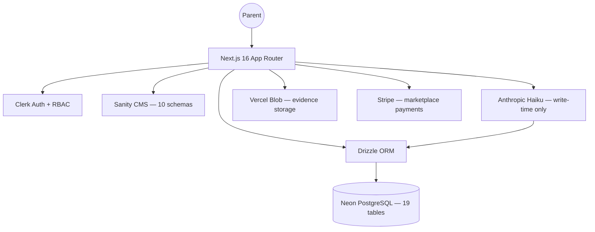
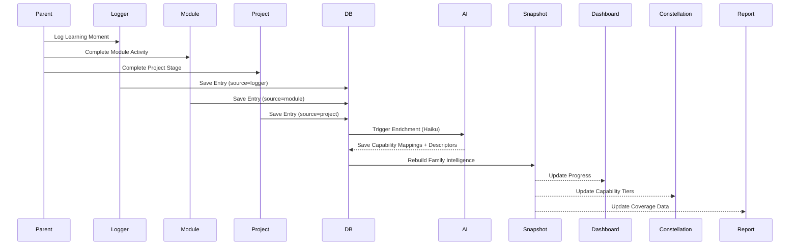

# System Map

## 1. System Overview
Hearth is a Learning Management System (LMS) specifically tailored for Australian homeschool families, particularly those complying with Queensland (HEU) regulations. Unlike traditional "forward-planning" LMS platforms, Hearth prioritizes **retrospective logging**—capturing learning as it happens and using AI to map those "moments" to formal educational capabilities and compliance requirements.

## 2. Architecture Layers
- **Frontend:** Next.js 16 (App Router) using React 19. Styled with Tailwind CSS v4 using a custom "Mont Blanc Dark Coffee" theme.
- **Backend:** Next.js Server Components and API Routes. Authentication is handled by Clerk (Family-based model with RBAC: owner/editor/viewer).
- **Data:** PostgreSQL (Neon serverless) managed via Drizzle ORM (19 tables). Content management is handled by Sanity CMS (10 schema types).
- **Payments:** Stripe for marketplace pack purchases.
- **Integrations:**
    - **Clerk:** Identity and multi-user family accounts with co-facilitator invites.
    - **Sanity:** Portable, philosophy-neutral learning content (Pack → Module → Approach → Activity hierarchy, plus Projects and Pedagogy Overlays).
    - **Anthropic (Claude Haiku):** Write-time AI enrichment — no runtime LLM calls. Enriches entries with subject detection, capability mapping, AC V9 descriptors.
    - **Vercel Blob:** Evidence photo/document storage.

## 3. Key Modules
- `src/app/(auth)`: Core application experience — 20+ screens:
  - **Home:** Dashboard (learner rows, moments grid, desktop panel)
  - **Our Story:** Portfolio, HEU Report, Capabilities Constellation, Learner Profile
  - **Log:** Retrospective Logger (voice input, multi-child, subject selection)
  - **Explore:** Activity Discovery, Marketplace
  - **Build:** Module Builder (5 pathways), Badge Creator
  - **Experience:** Module Experience (prep/facilitate/log modes), Project Experience (multi-stage), Badge Assessment
  - **Settings:** Family Settings (pedagogy, HEU, notifications), Notification Centre
- `src/app/api`: 48 route files (65 handlers) — entries, badges, capabilities, planner, notifications, report, family, modules, stripe, admin.
- `src/components`: Shared UI primitives (`ui/`), layout components (`layout/`), screen-specific groups (`screens/`).
- `src/lib/db`: Drizzle schema (19 tables), client, migrations.
- `src/lib/ai`: AI enrichment pipeline — `enrich.ts` (Haiku enrichment), `keyword-matcher.ts` (fallback), `snapshot-rebuild.ts` (aggregation).
- `src/lib/pedagogy`: Pedagogy vocabulary adapter — maps 6 pedagogies (Charlotte Mason, Classical, Montessori, Waldorf, Unschooling, Eclectic) to UI terminology.
- `src/sanity/schemas`: 10 content schemas (capabilityThread, badge, activity, approach, module, pack, project, projectStage, pedagogyOverlay, moduleSkeleton).
- `docs/`: Canonical specifications and architectural decision logs.
- `prototypes/`: Original HTML/JSX prototypes (visual reference only).

## 4. Data Flow

### Primary: Retrospective Logging
1. **Capture:** Parent records a "Learning Moment" in the **Retrospective Logger** (or completes a **Module Experience** / **Project Stage**).
2. **Persistence:** Entry saved to `learning_entries` in PostgreSQL with source tracking (`logger` | `module` | `project` | `import`).
3. **Enrichment:** AI pipeline (Haiku) analyses the entry — detects subjects, maps capability threads, identifies AC V9 curriculum descriptors. Token usage logged to `ai_pipeline_logs`.
4. **Synthesis:** `rebuildSnapshot()` aggregates all entries into per-child capability profiles in `family_intelligence_snapshots`. Triggers badge threshold checks.
5. **Output:** Pre-computed snapshot data rendered across Dashboard, Capabilities Constellation, HEU Report, and Portfolio — no runtime AI calls.

### Secondary: Module/Project Experience
1. Parent selects module/project from library or marketplace.
2. **Prep mode** shows materials, facilitator guidance, understanding indicators.
3. **Facilitate mode** runs a session timer, displays activity steps.
4. **Log mode** captures per-child engagement, discoveries, understanding level — creates a `learning_entry` with `sourceModuleId` / `sourceProjectId`.
5. Entry flows through standard enrichment pipeline.

### Tertiary: HEU Compliance
1. Parent creates an HEU report (`heu_reports` table) for a learner + year.
2. Six work sample slots created (`work_samples`): early/later writing, maths, choice area.
3. Parent assigns entries to slots, adds annotations (`work_sample_annotations`).
4. PDF export generates compliance document with curriculum coverage, work samples, and gap analysis.

## 5. Capability Mapping
- **Retrospective Logger** → `learning_entries` + Web Speech API (en-AU).
- **Module Experience** → `learning_entries` (source=module) + Sanity module/approach/activity content.
- **Project Experience** → `learning_entries` (source=project) + Sanity project/stage content + artifact capture.
- **Weekly Planner** → `planner_entries` + Sanity module library.
- **Our Story (Portfolio)** → `learning_entries` (filtered for evidence) + `learners` profile data.
- **Capabilities Constellation** → `family_intelligence_snapshots` + capability thread taxonomy + tier overrides.
- **HEU Report** → `heu_reports` + `work_samples` + `work_sample_annotations` + PDF generation.
- **Badges** → `badge_definitions` + `badge_awards` + `badge_assessment_logs` + threshold checks.
- **Compliance Tracking** → `capability_threads.ts` static data + AI enrichment layer.
- **Pedagogy Overlay** → Sanity `pedagogyOverlay` documents + `familySettings.pedagogyPreference` + vocabulary adapter.

## 6. Known Risks / Fragility
- **AI Latency:** Heavy reliance on AI for enrichment requires the snapshot caching strategy to maintain the "5-minute rule." All screens read pre-computed data.
- **Design Drift:** Risk of divergence if `hearth-canonical-design-tokens-v1.md` is not strictly followed. Conformance pass completed 2026-03-20.
- **Offline Support:** Not addressed — app requires connectivity.

## 7. System Maturity
- **Phase:** Pre-Launch Hardening (Phase 1 MVP)
- **Screens:** 20+ auth-protected routes implemented, all conformant to design system.
- **Schema:** Drizzle schema solidified — 19 tables supporting family model, AI pipeline, badges, planner, HEU compliance, co-facilitators.
- **Content:** Starter Pack seeded (121 Sanity docs, 79 activities).
- **RBAC:** `checkWritePermission()` gates all write endpoints to owner/editor roles.
- **Launch target:** 10-20 test families in Queensland, Australia.

## 8. Visual Diagrams (Mermaid)

### System Structure

### Core Data Flow

