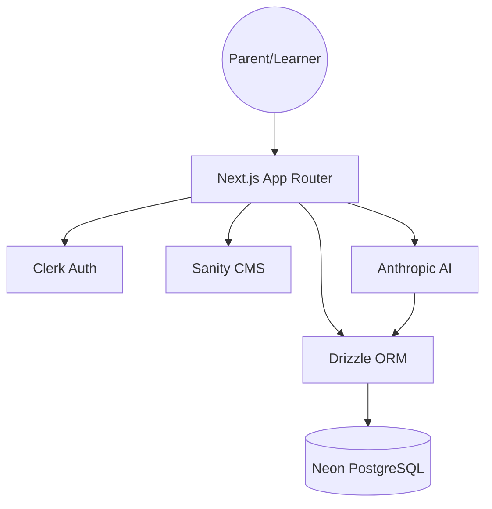
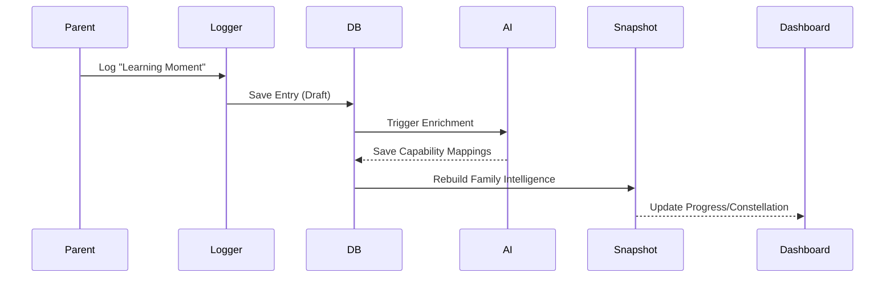

# System Map

## 1. System Overview
Hearth is a Learning Management System (LMS) specifically tailored for Australian homeschool families, particularly those complying with Queensland (HEU) regulations. Unlike traditional "forward-planning" LMS platforms, Hearth prioritizes **retrospective logging**—capturing learning as it happens and using AI to map those "moments" to formal educational capabilities and compliance requirements.

## 2. Architecture Layers
- **Frontend:** Next.js 15+ (App Router) using React 19. Styled with Tailwind CSS v4 using a custom "Mont Blanc Dark Coffee" theme.
- **Backend:** Next.js Server Components and API Routes. Authentication is handled by Clerk (Family-based model).
- **Data:** PostgreSQL (Neon serverless) managed via Drizzle ORM. Content management is handled by Sanity CMS (headless).
- **Integrations:** 
    - **Clerk:** Identity and multi-user family accounts.
    - **Sanity:** Portable, philosophy-neutral learning content/modules.
    - **Anthropic (Claude):** AI intelligence layer for transforming raw parent logs into structured educational insights.

## 3. Key Modules
- `src/app/(auth)`: The core application experience (Dashboard, Log, Planner, Our Story, Settings).
- `src/app/api`: Server-side logic for data persistence and AI processing.
- `src/components`: Feature-specific UI components (e.g., `planner/`, `notifications/`, `learner/`).
- `src/lib/db`: The relational source of truth (Drizzle schema and migrations).
- `src/lib/ai`: Logic for the "Family Intelligence" pipeline.
- `src/sanity`: Content schemas for modules, packs, and pedagogical overlays.
- `docs/`: Canonical specifications and architectural decision logs.
- `prototypes/`: Reference implementation for the Next.js transition.

## 4. Data Flow
1. **Capture:** Parents record a "Moment" in the **Retrospective Logger**.
2. **Persistence:** The entry is saved to `learning_entries` in PostgreSQL.
3. **Enrichment:** The AI pipeline (Anthropic) analyzes the entry against **Capability Threads** (Literacy, Math, etc.).
4. **Synthesis:** Enrichment data is aggregated into **Family Intelligence Snapshots** for fast UI rendering.
5. **Output:** Data is surfaced in the **Capabilities Constellation** (visual progress) and the **HEU Report** (compliance export).

## 5. Capability Mapping
- **Retrospective Logger** → `learning_entries` table + Web Speech API.
- **Weekly Planner** → `planner_entries` table + Sanity Module library.
- **Our Story (Portfolio)** → `learning_entries` (filtered for evidence) + `learners` profile data.
- **Compliance Tracking** → `capability_threads.ts` logic + AI enrichment layer.

## 6. Known Risks / Fragility
- **Data Persistence Gap:** The project is currently transitioning from static prototypes to a live DB. Many screens may still rely on mock data.
- **AI Latency:** Heavy reliance on AI for enrichment requires a robust caching/snapshot strategy (Snapshots) to maintain the "5-minute rule."
- **Design Drift:** High risk of divergence between the `prototypes/` and the new Tailwind v4 implementation if the `canonical-design-tokens` are not strictly followed.
- **Inter-screen Navigation:** The current "Skeleton App" phase is still connecting isolated routes into a cohesive user journey.

## 7. Recent System Changes (Interpreted)
- **Transition Initialized:** The project has moved from a "Pure Prototype" phase (HTML/JSX files) to a "Next.js Deployment" phase.
- **Schema Solidified:** The Drizzle schema now explicitly supports the multi-tenant "Family" model and the AI intelligence pipeline.
- **Design System Codified:** Tailwind v4 and CSS variables have replaced ad-hoc styling to ensure visual consistency across the 22 planned screens.

## 8. Visual Diagrams (Mermaid)

### System Structure

### Core Data Flow

